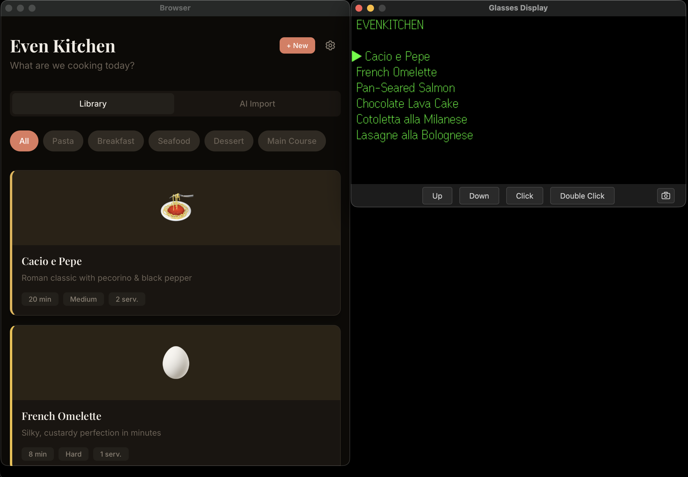
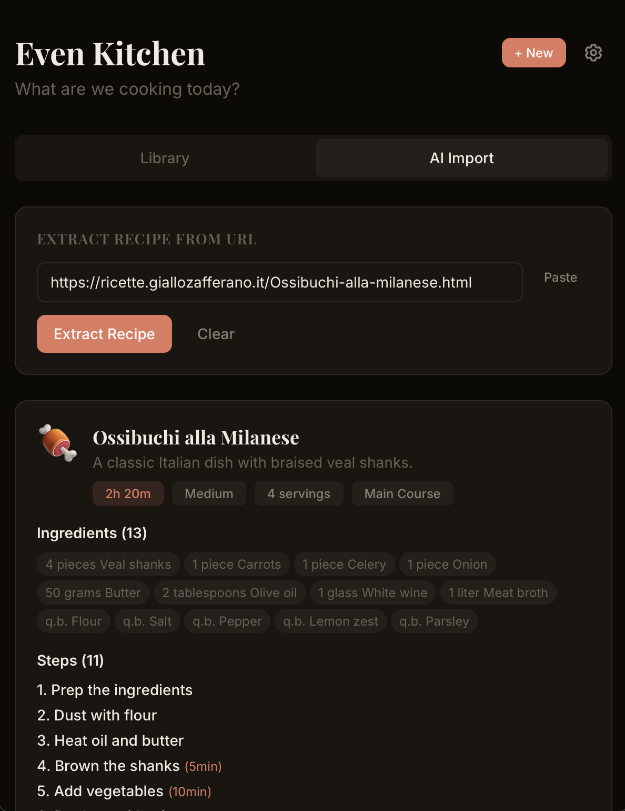
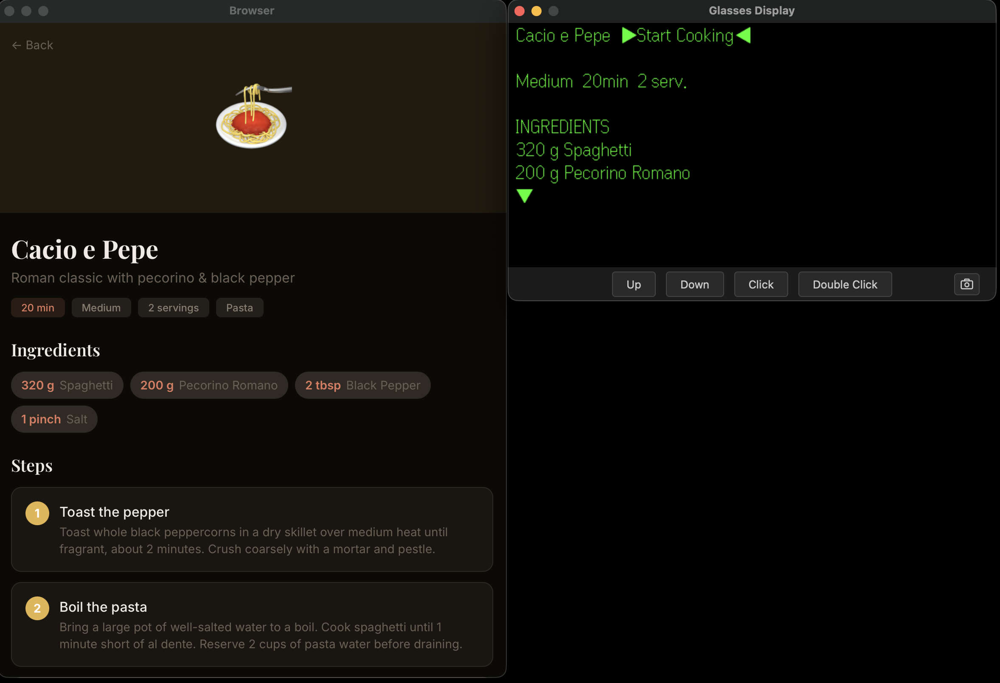
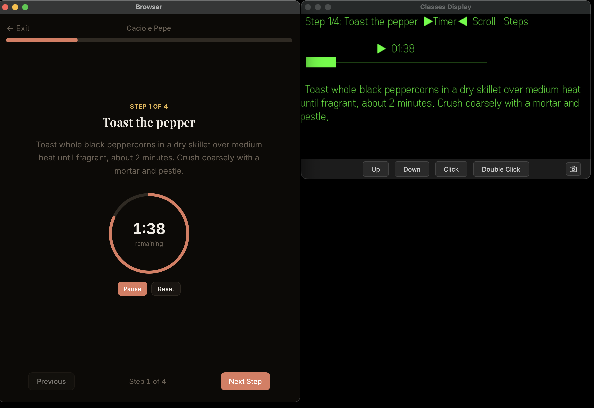
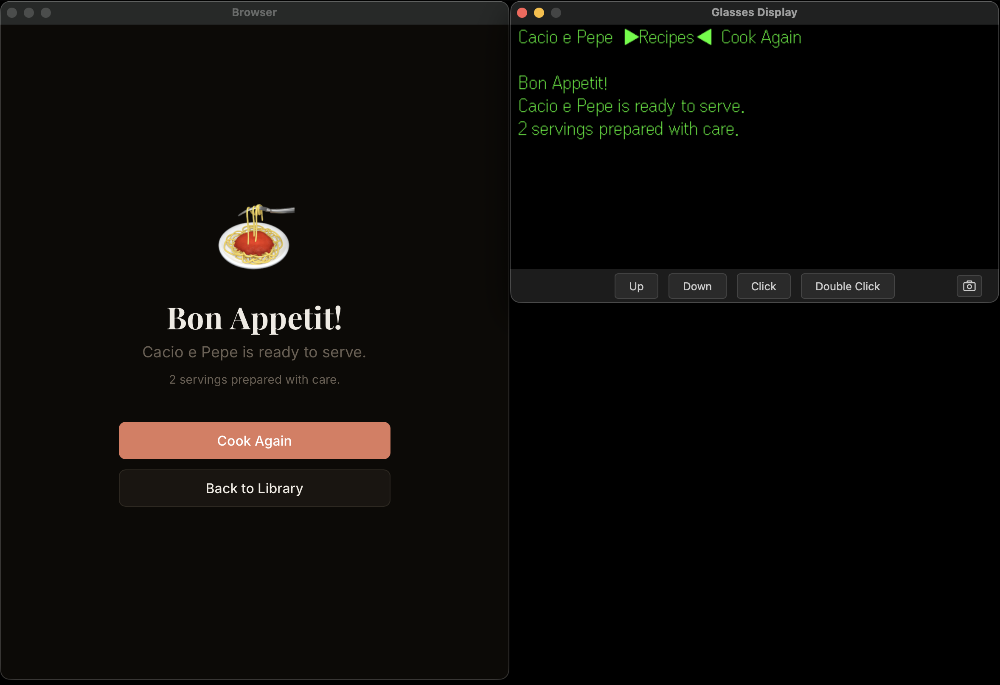
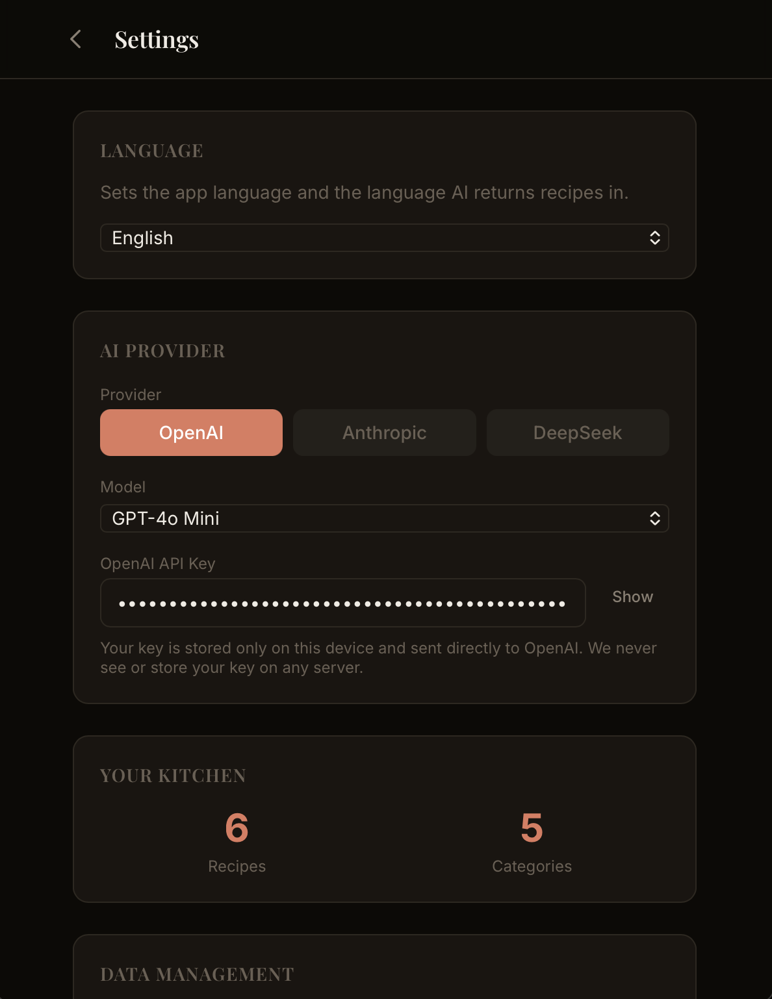

# EvenKitchen

A hands-free cooking companion for **Even Realities G2 glasses**. Browse recipes, follow step-by-step cooking instructions with independent per-step timers, import recipes from any URL using AI, and navigate everything hands-free on your glasses while cooking.


---

## Features

### Recipe Library
- Browse recipes by category with a filter bar
- Add, edit, delete, archive/unarchive recipes
- Export/import recipes as JSON for backup and sharing



### AI-Powered Recipe Import
- Paste any recipe URL and extract the full recipe using AI
- Supports **OpenAI** (GPT-4o, GPT-4o Mini), **Anthropic** (Claude Sonnet 4, Claude Haiku 4.5), and **DeepSeek** (Chat, Reasoner)
- Faithfully extracts every step, ingredient, and timing from the original source
- Automatically translates recipes into your chosen language
- API keys encrypted at rest using Web Crypto API (AES-256-GCM)



### Recipe Detail
- Full recipe overview: ingredients, steps, prep/cook time, servings, difficulty
- Start cooking with one tap
- Edit, archive, or delete recipes



### Guided Cooking Mode
- Step-by-step instructions with large, readable text
- **Independent per-step timers** — start a timer on step 1, navigate to step 3 to prep, come back and the timer is still running
- Timers persist across page refreshes (saved to localStorage)
- Visual progress bar and step counter
- Navigate freely between steps without losing timer state



### Completion Screen
- Celebratory finish screen with recipe emoji
- Cook Again (resets everything) or Back to Library



### Multi-Language Support
- 9 languages: English, Italian, Spanish, French, German, Portuguese, Japanese, Chinese, Korean
- All UI labels translated
- AI recipe extraction returns recipes in your selected language
- Language applies instantly on selection

### Settings
- Choose AI provider and model
- Per-provider API key storage (encrypted at rest)
- Language selection
- Data management: export, import, reset
- Stats: recipe count, category count



---

## G2 Glasses Integration

EvenKitchen is designed for hands-free cooking. Every screen has a dedicated glasses display with full navigation.

### Glasses: Recipe List
- Scroll to browse recipes (archived recipes hidden)
- Tap to select a recipe
- Double-tap to go back

### Glasses: Recipe Detail
- Recipe name + `▶Start Cooking◀` button in top bar
- Scroll to read ingredients, steps, and timings
- Tap to start cooking
- Double-tap to go back to list

### Glasses: Cooking Mode
- **Action buttons** in the top bar: `[Timer]` `[Scroll]` `[Steps]` `[Finish]`
- Scroll cycles between buttons, tap activates:
  - **Timer**: toggles the step timer (only shown on timed steps)
  - **Scroll**: enters scroll mode to read long instructions
  - **Steps**: enters step navigation mode (scroll = change step)
  - **Finish**: appears on last step, completes the recipe
- Active mode shows **blinking triangles** (`▶◀` / `▷◁`)
- Timer displays with progress bar (`████────────`)
- Timer + step header always visible, instructions scroll below

### Glasses: Completion
- Recipe name + action buttons (`▶Recipes◀` `Cook Again`) in top bar
- Bon Appetit message matching the web UI

---

## Demo

https://github.com/user-attachments/assets/demo.mp4

[](docs/videos/demo.mp4)

---

## Tech Stack

- **React 19** + **TypeScript** + **React Router 7**
- **Tailwind CSS 4** with CVA (Class Variance Authority)
- **Even Realities SDK** (`@evenrealities/even_hub_sdk` + `@jappyjan/even-better-sdk`)
- **even-glass** shared library for glasses display, action mapping, keyboard/wheel input, timer display
- **Web Crypto API** for AES-256-GCM encryption of API keys at rest
- **Vite 5** for development and builds
- All data stored locally in **localStorage** — no server, no user data collection

## Project Structure

```
even-kitchen/
  src/
    App.tsx                     # Routes
    main.tsx                    # Entry point
    types/recipe.ts             # Recipe, AppSettings, AI provider types
    data/
      seed-recipes.ts           # 4 default recipes
      persistence.ts            # localStorage + encryption
    contexts/
      RecipeContext.tsx          # Recipe CRUD, settings, useReducer
      CookingContext.tsx         # Per-step timers, step index, persisted
    hooks/
      useRecipes.ts             # Filtered recipe list
      useTimer.ts               # Per-step timer tick logic
      useCookingProgress.ts     # Step progress calculation
      useRecipeExtractor.ts     # AI extraction (OpenAI/Anthropic/DeepSeek)
      useTranslation.ts         # i18n hook
    screens/
      RecipeLibrary.tsx          # Home: recipe grid + AI import tab
      RecipeDetail.tsx           # Recipe overview + start cooking
      RecipeForm.tsx             # Add/edit recipe form
      CookingMode.tsx            # Step-by-step cooking
      Completion.tsx             # Bon Appetit screen
      Settings.tsx               # Language, AI, data management
    components/
      ui/                        # Button, Card, Badge, Progress
      shared/                    # CategoryFilter, RecipeCard, TimerRing, AIImportTab
    glass/
      KitchenGlasses.tsx         # Glass hook + snapshot
      selectors.ts               # Display rendering for all screens
      actions.ts                 # Glass action handler (scroll/tap/back)
    utils/
      i18n.ts                    # Translation strings (9 languages)
      crypto.ts                  # Web Crypto AES-256-GCM encryption
      format.ts                  # Time formatting, ID generation
      export.ts                  # JSON export/import helpers
      cn.ts                      # Tailwind class merge
    styles/app.css               # Theme + global styles
```

## Getting Started

```bash
# Install dependencies
npm install

# Start development server (accessible on local network for glasses testing)
npm run dev

# Build for production
npm run build

# Generate QR code for Even Hub testing
npx @evenrealities/evenhub-cli qr --port 5173 --path / --ip <your-local-ip>
```

## Privacy & Security

- **No server, no accounts, no data collection** — everything runs in your browser
- API keys are **encrypted at rest** using AES-256-GCM with a non-extractable key stored in IndexedDB
- API calls go **directly from your device to the AI provider** over HTTPS
- We never see, store, or transmit your API keys

## License

MIT
